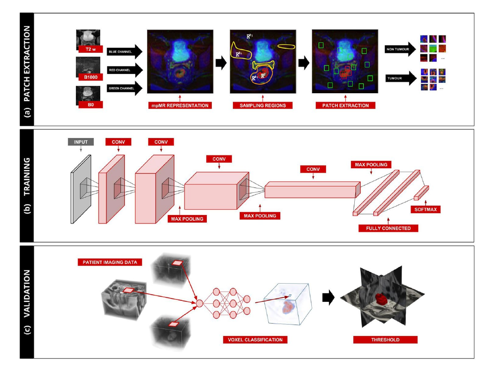

# Deep Learning for Fully-Automated Localization and Segmentation of Rectal Cancer on Multiparametric MR -- Paper summary
🔗[Paper source](https://www.nature.com/articles/s41598-017-05728-9)

## Goal
Develop a deep learning based network for the fully automatic localization and segmentation of locally advanced rectal tumors.

## Data 
- MRI scans of 140 patients from 2 centers
  - 97 males, age range 43-87
  - 43 females, age range not stated 
  - with locally advanced rectal cancer
- MRI done prior to standard chemo-therapy treatment
- divided between discovery(train) - 70scans and validation(test) - 65 scans, 5 scans were corrupted
- two expert radiologists segmented each tumor
  
## CNN architecture
- voxel( 3D pixel ) classifier
- for each voxel *v*
  1. extracted a fixed-size patch surrounding 
  2. classified the patch via a trained instance of the CNN
  3. collected the resulting probability
  4. assigned the resulting probability to *v* 
- generated a probability map where *p(v)* is the probability of voxel *v* to represent tumour tissue
- the segmentation was generated by thresholding the of the probability maps and subsequent selection of the largest connected component

### Network definition

The discovery set was divided into training set (80%) and test set (20%). Train test used for training the net and test set was used alongside the training procedure to check for model overfitting. The training procedure was designed to stop when no improvement was made for at least five consecutive epochs.

To evaluate the stability of the algorithm, this process -- sampling, training, testing four times and compared the segmentations generated by the different runs of the algorithm

## Patch extraction
- *N* voxels were randomly sampled from each of the foreground( tumor region ) and backgorung ( non-tumor region ) -- ensuring balanced representation during training
- For each vowel the extraction of the surrounding in-place patch of size MxM was made
- **PROBLEM** the prostate and the tumour regions have similar intensity -> this made the classifying process more difficult

## Results
The CNN was trained on the multiparametric MR imaging of 70 patients. For each patient, 5000 patches ( size 21x21 voxels ) were created for both tumour and non-tumour areas.
The discovery data consisted of:
  - train set - 560K patches
  - test set - 140K patches

###Training
#### Train set 
**Accuracy:** 0.895
**Loss:** 0.275

#### Test set 
**Accuracy:** 0.871
**Loss:** 0.331

### Validation 
The performance of the CNN classifier was validated on the validation data set consisting of multiparametric MR imaging of 65 patients. For each patient volumetric tumour segmentations were generated and compared to both expert readers. 

####  Voxel-by-voxel
- The area under the curve( AUC ) was computed between the CNN probability maps and the segmentations of the experienced readers. 
- The AUC of the resulting probability was very high for both readers, AUC=0.99.

#### Segmentation
To evaluate the performance of the of the segmentation Dice Similarity Coefficient (DSC) was used. 
- The average DSC between the two expert readers was high (0.83)
- DSC between the algorithm and Reader 1 = 0.68
- DSC between the algorithm and Reader 2 = 0.70

## Problems
- Anatomical parts - e.g. testicles classified( not part of the discovery set) as largest chunk and selected as candidate.

## Possible optimization
1. Focusing on alternative architectures which account for anatomical location
2. Shortening the time needed for the segmentation

## Conclusion
- Demonstration that deep learning can perform accurate localization and segmentation of rectal cancer in MR imaging in the majority of the patients
- Deep learning technologies have the potential to improve the speed and accuracy of MRI-based rectum segmentation