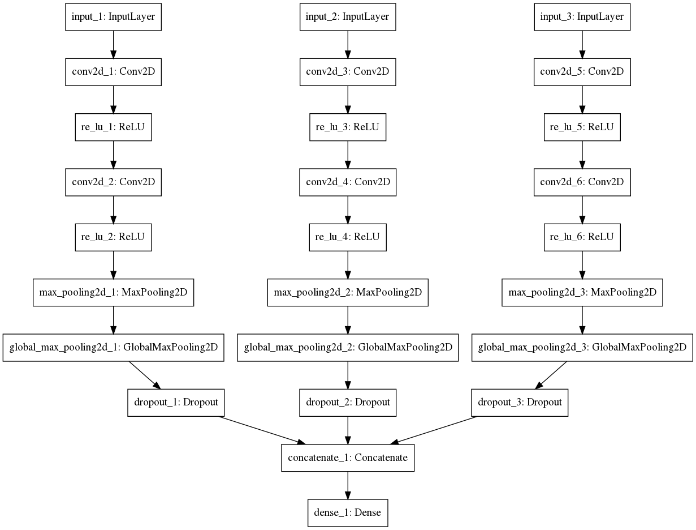

# Week 9 objectives

## Implementation of the second proposed model
The second model that Dr. Nowling and I have proposed is model that takes 3 images at a time, but each image is feeded into single convolutional parallel layer separately. The 3 parallel layers are concated at the end and output a single label whether the middle image contains prostate(true) or not(false).

### Model architechture

### Implementation
#### Image pre-processing
Before feeding the images into the network, the images needed to be pre-processed. Specifically we created 3 different training groups of images - train1, train2,train3 and 3 different testing groups of images - test1, test2, test3. The groups were created in the following fashion: [first_img, second_img, third_img, ...], [second_img, third_img, fourth_img, ...],[third_img, fourth_img, fifth_img, ...] so that images could be feeded parallelly. The implementation of the image pre-processing can be seen in the`create_parallel_imgs()` function. The labels were generated from the mask of the middle image per every group of 3 images.

#### Model architecure
We created 3 parallel identical layers which consisted of several different layers(see image). We then concatenated them using [keras.layers.concatenate](https://keras.io/layers/merge/) interface into one single layer. This merged layer was then feeded into the output Dense layer. For implementation see function `get_unet()`.

#### Training the models
Training output of the models can be found in the `training-outputs` folder. 

### Model evaluation
All models were trained with **dropout rate - 0.5**.

| batch_size        | number of training epochs           | accuracy on testing data | loss on testing data |
| ------------- | ------------- | ----- | ----- |
| 2     | 50 | 0.645 | 4.461    |
| 2      | 100      |   0.642 | 4.658 |
| 4 | 100      | 0.619    | 4.719 |

