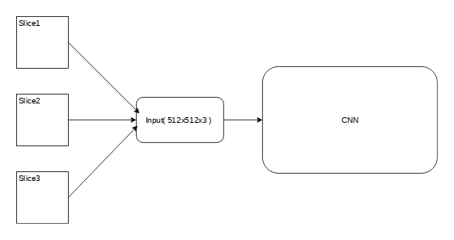
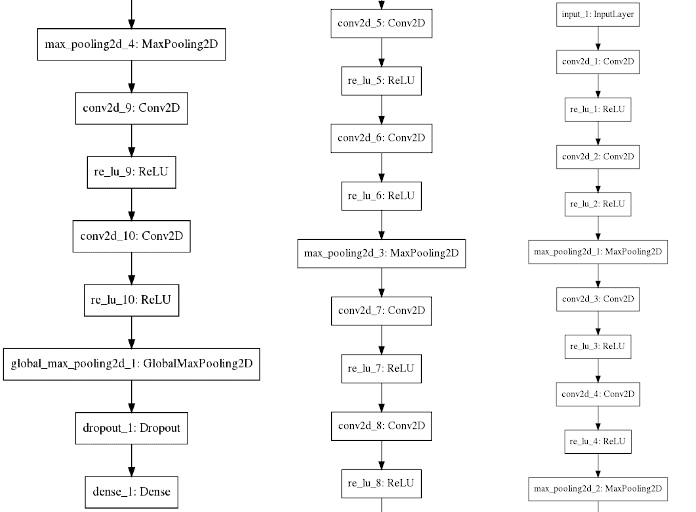
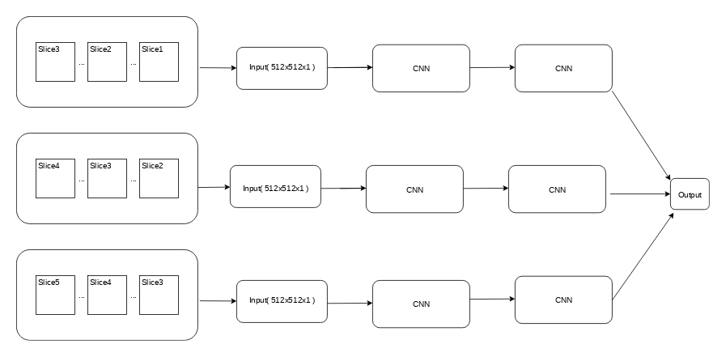
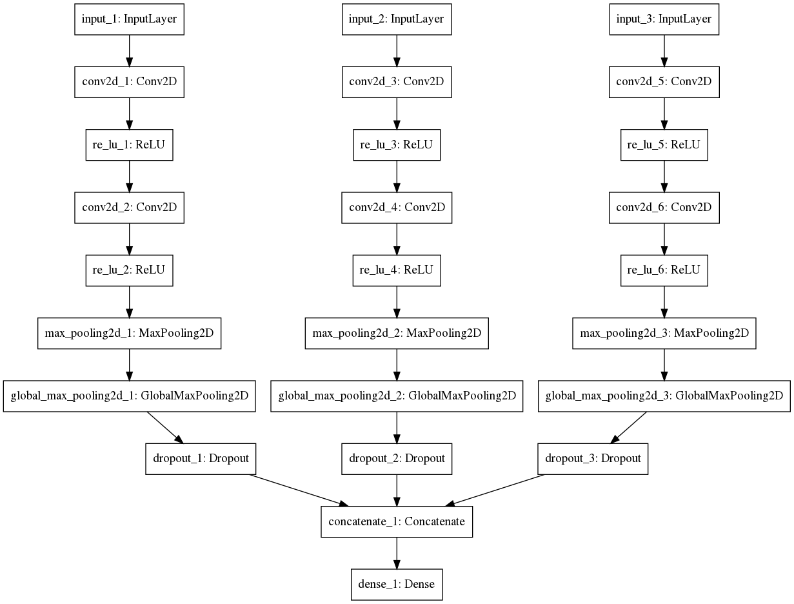
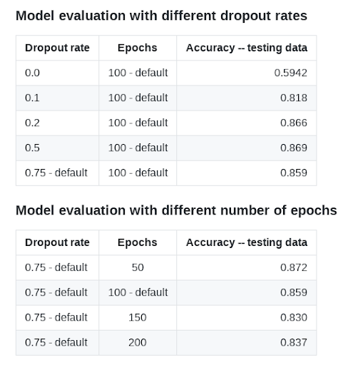
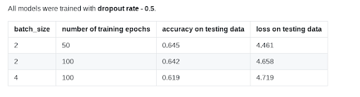

# Using the adjacent images in order to improve prostate classification accuracy
Oliver Blasko, Dr. Ronald J. Nowling

## Problem description
The main goal of this project is to improve the base prostate classification model which takes one image( slice ) of the prostate scan and classifies it as a prostate-containing( true ) or not ( false ). We'll try to improve the classification model, e.g. increase it's accuracy by taking into account adjacent images( slices ) of the MRI scans and try to gain deeper perspective of the surrounding which may or may not give us better context and therefore improve model's accuracy.

**Hypothetis:**
Using the adjacent images( slices ) will improve classification accuracy of the base model.

## Methods

### Data set
The data set consisted of 1,235 Magnetic Resonance T2-weighted images from 39 patients with prostate cancer (mean age 60 years). All images were collected on a 3-T MRI scanner (GE) using an endorectal coil and stored as 512 × 512-pixel grayscale images. The dataset was stratified randomly by patient into training (66%) and testing (33%) sets. Ground truth prostate masks were drawn by a single, trained human observer.

### Base model
The base model that we'll try to improve is a prostate classification model taking one image(slice) at a time. This model reached the accuracy of **0.89** on the testing data. This is our starting point.

### Model A
The first model that we'll try is classification model that takes 3 concatenated images as a one input and outputs label for the middle slice. See picture.

#### Image pre-processing
Every patient slices were sorted and concatenated in a following pattern: [slice_n, slice_n+1, slice_n+2]; where n is in range( 1, number of slices per patient ). Padding technique was used in order to classify first and last slice of each group.

#### Model architecture

#### Training 
The model was trained on a different number of epochs and with different dropout rates. The best accuracy that we've reached was **0.87**.

### Model B
The second model that we'll try is model that has 3 parallel CNN layers and takes each slice as a input into one parallel layer respectively. Parallel layers then get concatenated and output a classification label for the middle slice. 

#### Image pre-processing
We created 3 different training groups of images - train1, train2, train3 and 3 different testing groups of images - test1, test2, test3. The groups were created in the following fashion: [slice_1, slice_2, ... , slice_n], [slice_2, slice_3, ... , slice_n-1],[slice_3, slice_4, ..., slice_n-2] so that images could be feeded parallelly. The labels were generated for the middle image per every group of 3 images. Padding technique was used in order to classify first and last slice of each group.

#### Model architecture

### Implementation
Our models were implemented in Python using Keras, Tensorflow, Scikit-Learn, Matplotlib, Seaborn, Scikit-Image and the Numpy Python package.

## Results

### Model A

### Model B

## Discussion and conclusion
As it can be seen in the tables we were unable to improve the accuracy of the base model and therefore unable to prove the hypothesis.