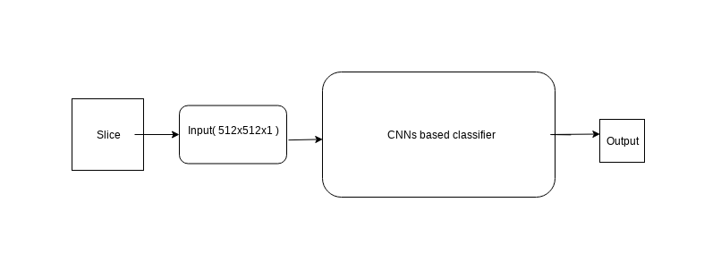
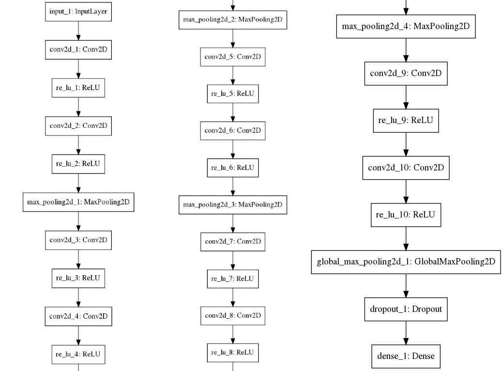
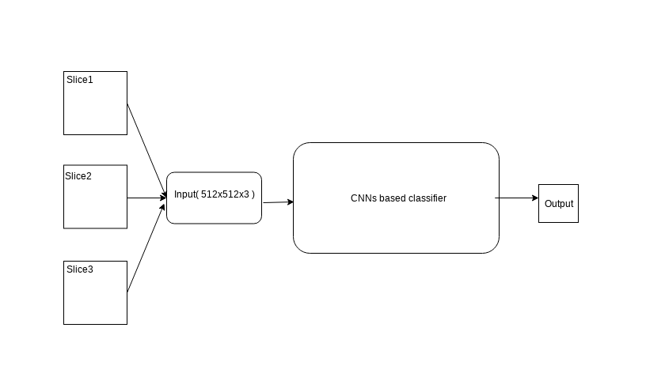
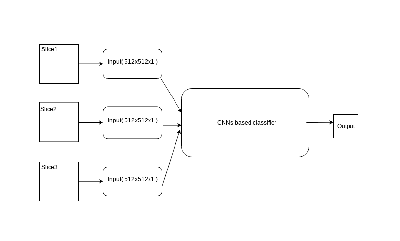

# Using the adjacent images in order to improve prostate classification accuracy
Oliver Blasko, Dr. Ronald J. Nowling

## Background
Convolutional networks( LeCun, 1989 ), also known as convolutional neural networks, or CNNs, are a specialized kind of neural network for processing data that has a known grid-like topology. Convolutional networks have been tremendously successful in practical applications. The name "convolutional neural network" indicates that the network employs a mathematical operation called convolution. Convolution is a specialized kind of linear operation. CNNs are simply neural networks that use convolution in place of general matrix multiplication in at least one of their layers [1]. CNNs based deep learning approaches can learn feature representations automatically from the training data. The multiple layers of the CNNs aim to process the imaging data different levels of abstractions, enabling the machine to navigate and explore large datasets and discover complex structures and patterns that can be used for prediction. The advancement of these techniques has been made possible by the availability of large imaging data and the accessibility of dedicated hardware devices such as graphical processing units(GPU). Particularly in the field of biomedical imaging, deep learning has been largely exploited for detection and segmentation purpose, where these methods are proven to systematically outperform traditional machine learning techniques and that's why are we choosing CNNs for solving our problem as well [2].

## Problem description
In this paper we tried to prove that using and taking into account the adjacent images of the MRI scans will give the CNNs based model deeper perspective of the surrounding which will improve the overall model accuracy. We built and evaluated 3 different models: **1. Base model** - model using only one image for the classifying task and two different models: **2. Concatenated model** and **3. Parallel model** that used also the surroundings of the image in order to perform the classification. The main task of this paper was to prove that the concatenated and parallel model have better accuracy than the base model which will prove the following hypothesis:
   
**Hypothetis:**
Using the adjacent images( slices ) will improve classification accuracy of the base model.

## Methods

### Data set
The data set consisted of 1,235 Magnetic Resonance T2-weighted images from 39 patients with prostate cancer (mean age 60 years). All images were collected on a 3-T MRI scanner (GE) using an endorectal coil and stored as 512 × 512-pixel grayscale images. The dataset was stratified randomly by patient into training (66%) and testing (33%) sets. Ground truth prostate masks were drawn by a single, trained human observer. The data was provided by the Medical College of Wisconsin [3]. 

### Base model
The base model is CNNs based classifier of images that takes only one single image at a time and perform the classification task on it. The output of the base model is binary - image contains prostate(true) or image doesn't contain prostate(false) -- see picture.
 

#### Image preprocessing
The images were firstly grouped by the patient ( every patient had multiple images )and then randomly stratified into training(66%) and testing set(33%). We needed to make sure that there is no overlap between the training and testing set, meaning no patient was present in both image sets.

#### Base model architecture
 

### Concatenated model
Tha concatenated model was using the same CNNs based classifier as the base model, the only change was in input. Instead of using only one slice, the concatenated model created the input from the 3 slices in order to gain more perspective of the surroundings of the middle slice. The concatenated model classified the middle slice in the same fashion as the base model, binary output -- contains prostate( true ), doesn't contain prostate( false ).

 

#### Image pre-processing
Firstly we grouped the images by the patient and then randomly stratified into training(66%) and testing set(33%). Secondly we sorted every group by the slice id so that the images were in order as they were taken. The sorted slices were then iterated over and every 3 images were concatenated into one input of dimension ( 512, 512, 3 ). The sliding window was of size 1 so every image was in 3 different inputs, at the first position, second and the third position. Padding technique was used in order to classify the first and the last slice of each group. The labels were generated from the mask of the middle slice as well as the output of the classifier was only for the middle slice.

#### Model architecture
 

### Parallel model
The second model that we tried was parallel mode that had 3 parallel conv layers and took each slice as a input into one parallel layer respectively. Parallel layers then got concatenated at the end. The model performed classification task on the middle slice. 
 

#### Image pre-processing
Firstly we grouped the images by the patient and then randomly stratified into training(66%) and testing set(33%). Secondly we sorted every group by the slice id so that the images were in order as they were taken. We created 3 different training groups of images - train1, train2, train3 and 3 different testing groups of images - test1, test2, test3. The groups were created in the following fashion: [slice_1, slice_2, ... , slice_n], [slice_2, slice_3, ... , slice_n-1],[slice_3, slice_4, ..., slice_n-2] so that images could be feeded parallelly. The labels were generated for the middle image per every group of 3 images. Padding technique was used in order to classify first and last slice of each group.

#### Model architecture
 

### Implementation
Our models were implemented in Python using Keras, Tensorflow, Scikit-Learn, Matplotlib, Seaborn, Scikit-Image and the Numpy Python package.

## Results

### Base model
The CNNs based classifying model was trained on 100 epochs with dropout rate = 0.75. The accuracy on the training data was **0.981**, with loss of 0.059. The performance on the testing was accuracy of **0.891** and loss of 0.386. These were the metrics that in order to prove our hypothetis needed to be improved with the next two models.

### Concatenated model
In order to find optimal parameters, the concatenated model was trained on multiple different numbers of epochs as well as with multiple dropout rates. In the tables below we can see that the model performed best with dropout rate = 0.5(accuracy of **0.869**) and when trained on 100 epochs. However the concatenated model wasn't able to outperform our base model.

 

### Parallel model
We weren't able to train the parallel model with the proposed architecture because the GPU didn't have enough memory for it. The adjusted parallel model performed very well on the training data( accuracy of ~99% ), but it seemed that the model overfitted the data because the accuracy on the testing data wasn't higher than 70%. This may be caused by very high number of parameters. In the table below we can see the performance on the testing data. The parallel model wasn't able to outperform the base model as well.

 

## Discussion and conclusion
As we can see in the results section both concatenated and parallel model wasn't able to outperform our base classifier with taking only one slice at a time. We weren't able to improve the accuracy of the base model and therefore unable to prove the hypothesis.

## References
[1] Ian Goodfellow, Yoshua Bengio and Aaron Courville "Deep learning", 9th chapter: Convolutional neural networks
[2] S. Trebeschi, J. J. M. van Griethuysen et al., “Deep learning for Fully-
Automated localization and segmentation of rectal cancer on multipara-
metric MR,”
[3] https://www.mcw.edu/